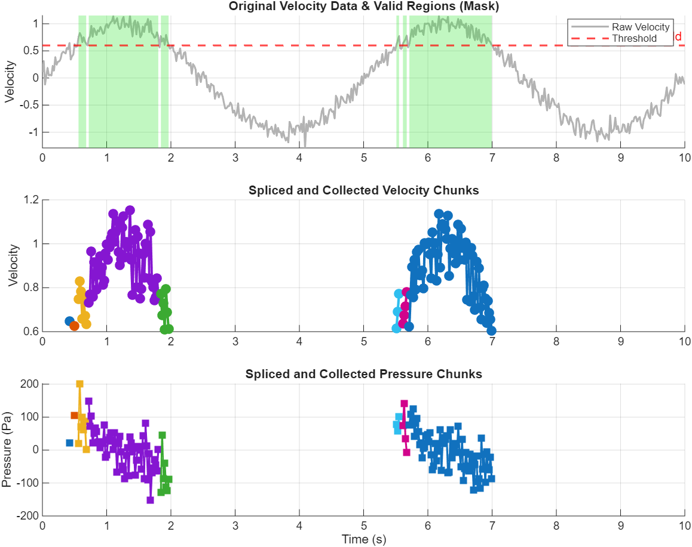
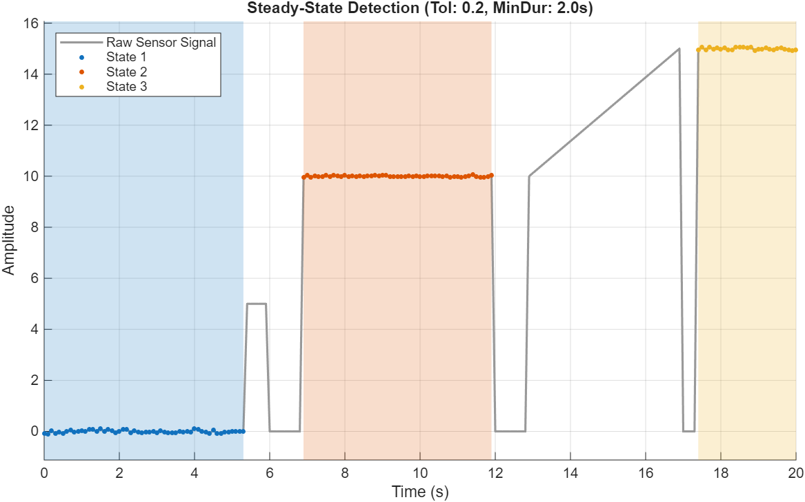
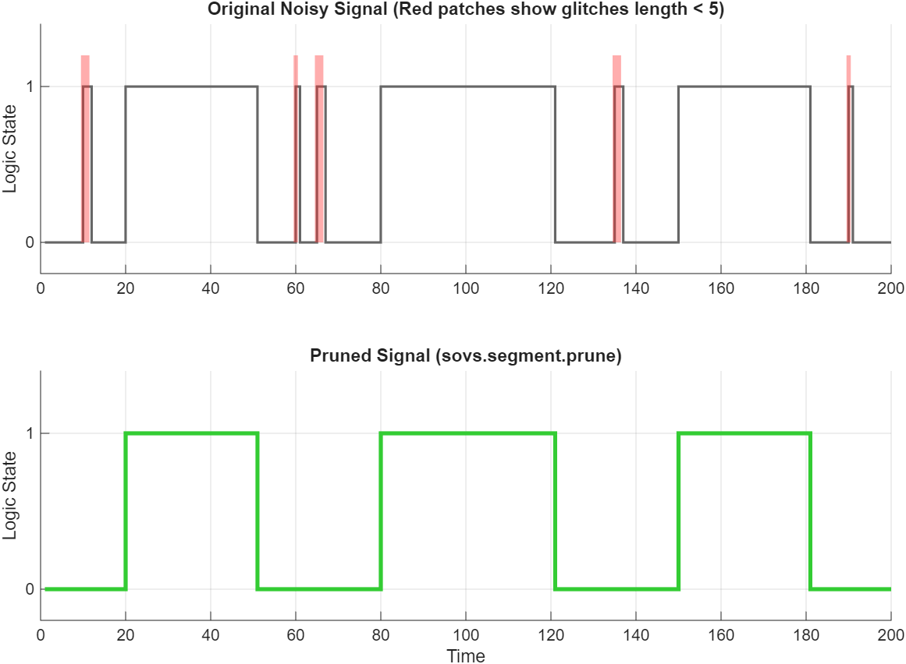

# Signal Segmentation Toolkit 🚀

A high-performance, vectorized toolkit for signal segmentation, Run-Length Encoding (RLE), and state-machine driven analysis. Optimized for large-scale engineering datasets (e.g., sensor logs).

  

## ✨ Why use this toolkit?
* **Dependency-Free**: Works out-of-the-box using base MATLAB. Zero reliance on toolboxes (like Image Processing or Signal Processing).
* **Vectorized Performance**: Built with JIT-optimized, loop-free architectures for massive N-dimensional arrays.
* **Sequential Contiguity**: Designed to respect temporal and sequential block structures.
* **Global Trend Awareness**: Original algorithms for monotonic filtering using global cumulative logic.

## 🛠 Available Functions

| Function | Category | Description |
| :--- | :--- | :--- |
| `bounds` | RLE | Returns start, end, and length of contiguous segments. |
| `collect` | Slicing | Cuts multi-channel data into cells based on mask boundaries. |
| `labels` | Mapping | Vectorized state-change counter for sequential ID maps. |
| `modify` | Morphology | Precise 1D expansion (dilate), shrink (erode), or slide. |
| `prune` | Filtering | Ultra-fast length filter to eliminate short segments. |
| `locate` | State-Machine | JIT-optimized steady-state detector (Pure MATLAB). |
| `rmNonMonotonic` | Filtering | Synchronous cleaning based on global monotonic trends. |

## 🚀 Quick Start

### Installation
Clone the repository and add the root directory to your MATLAB path.

~~~matlab
addpath('path/to/signal-segmentation-toolkit')
~~~

### Basic Usage
This toolkit uses a professional namespace (`sovs.segment`). You can import the package for cleaner code:

~~~matlab
import sovs.segment.*

% Example: Detect steady states in a noisy signal
[labels, n] = locate(time, signal, 0.1, 0.5);

% Example: Clean and sync non-monotonic data
[t_clean, v_clean] = rmNonMonotonic(t, v);
~~~

## 📈 Visual Demos
The `examples/` folder contains interactive scripts to visualize the algorithms:

* **`demo_segment_collect`**: Shows synchronized multi-channel slicing.
* **`demo_segment_locate`**: Visualizes the state-machine locking on stable regions.
* **`demo_segment_prune`**: Demonstrates digital signal despeckling.

  
  
  

## 📜 Citation & Acknowledgments
The core algorithms and original concepts (such as the global cumulative approach for monotonic masking) were designed and implemented by Saeed Oveisi. Google Gemini was utilized as an AI assistant for code refactoring and documentation drafting.

---
**Author**: Saeed Oveisi  
**Email**: [oveisi.saeed@gmail.com](mailto:oveisi.saeed@gmail.com)  
**GitHub**: [@144saeed](https://github.com/144saeed)